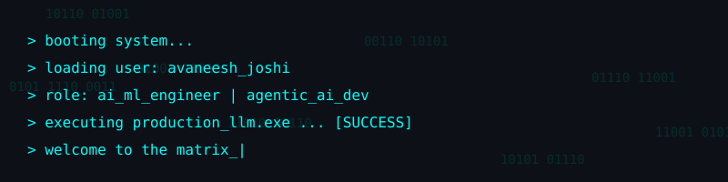

<p align="center">
  
</p>

<p align="center">
  <a href="https://linkedin.com/in/avaneeshjoshi18"></a>
  <a href="mailto:avaneeshjoshi18@gmail.com"></a>
  <a href="https://avaneeshportfolio.netlify.app"></a>
  <a href="https://github.com/Avaneesh635"></a>
</p>

---

### `whoami` // About Me
```python
#!/usr/bin/env python3
class AvaneeshJoshi:
    def __init__(self):
        self.role = "AI/ML Engineer | GenAI & Agentic AI Developer"
        self.focus = ["Agentic AI", "RAG Systems", "Local LLMs", "Workflow Automation"]
        self.track_record = "Independently shipped 4+ production-grade AI systems."
        self.open_source = "10+ merged PRs to a LangGraph-based self-healing engine."
        self.status = "Fresher | Open to Full-Time Roles & Relocation"
```

---

### `~/projects` // Featured Builds
| Project | Architecture & Impact | Stack |
| :--- | :--- | :--- |
| 🧠 **DocOps Agent** | **Self-Healing RAG:** LangGraph state machine with auto-retry loops, semantic caching (Redis), and Ragas-style evaluation guardrails. | `LangGraph` `pgvector` `Redis` `FastAPI` |
| 💼 **Biz Ops Copilot** | **Zero-Intervention Platform:** Consolidated 5+ business functions into an automated n8n pipeline, reducing manual reporting time by ~70%. | `n8n` `Groq LLM` `Google Sheets` |
| 🌙 **Luna** | **Offline Desktop Assistant:** Privacy-first Electron app running local Ollama LLMs with agentic memory extraction & consent-gated OS automation. | `Electron` `React` `Ollama` `TS` |
| ⚡ **Redis-Lite** | **Async KV Store:** Multi-threaded Rust server with Tokio, 16-way database sharding to eliminate lock contention, and background GC. | `Rust` `Tokio` `RESP Protocol` |

---

### `sudo ./open_source.sh` // Contributions
**E2E-Self-Heal** *(LangGraph/Playwright Engine)*
*Promoted from Contributor to Collaborator.*
- **MatchScorer & SnapshotStore:** Built deterministic network-mock replay and persistent Shadow Runtime state (rated **"Core Feature"** by maintainer).
- **Shadow Testing Orchestration:** Wired end-to-end headless Chromium replay and implemented AST-based selector diffing (replacing fragile regex).
- **shadow-verify:** Added a gating node for deterministic offline replay before live runs (rated **"Core Feature"**).
- **Quality:** Added 70+ `pytest` unit tests and a cross-platform Windows symlink fix.
- [🔗 Repository: Lee-Dongwook/E2E-Self-Heal](https://github.com/Lee-Dongwook/E2E-Self-Heal)

---

### `nmap -sV skills.local` // Tech Stack
```bash
PORT        STATE    SERVICE
Languages   open     Rust, Python, TypeScript, C++, Java
AI/GenAI    open     LangGraph, OpenAI, Groq, Agentic Systems, RAG, Guardrails
ML/CV       open     Scikit-Learn, OpenCV, FAISS, Sentence Transformers
Backend     open     FastAPI, Flask, Tokio, Docker, PostgreSQL, Redis, REST APIs
Automation  open     n8n, GitHub Actions, Postman, Webhooks
```

---

### `cat ./certifications.txt` // Credentials
`🏅 GCP ML Engineer` • `🏅 AWS Cloud Practitioner` • `🏅 Oracle Agentic AI Certified`

<div align="center">
  
</div>
